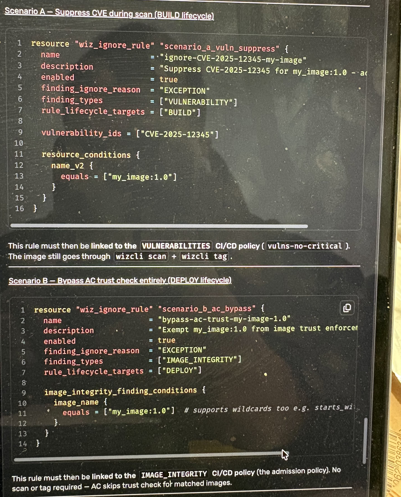

# A few changes requested:

## 1. change `exemptions_deploy` folder structure to:

```
exemption_deploy
├── unikube # EKS platform powered by terraform
│   ├── dev
│   │   ├── global.yaml
│   │   └── CLUSTER_NAME.yaml
│   ├── nonprod
│   │   ├── global.yaml
│   │   └── CLUSTER_NAME.yaml
│   ├── preprod
│   │   ├── global.yaml
│   │   └── CLUSTER_NAME.yaml
│   └── prod
│       ├── global.yaml
│       └── CLUSTER_NAME.yaml
└── pck # on prem platform
```

just focus on unikube for now. PCK is different team. it is guaranteed that CLUSTER_NAME is unique

 `wiz-v2_ignore_rule` logic
The `wiz-v2_ignore_rule` have to correspond to type of `wiz-v2_cicd_scan_policy` like `TYPE=VULNERABILITIES,SECRETS,MALWARE,IMAGE_INTEGRITY`. So actually this act as a 2 tiers?
For example cluster unikube/dev/anp02.yaml have this setup: one `wiz-v2_cicd_scan_policy` named: `container-admission-<cluster>` with these configuration: 
  - `TYPE=IMAGE_INTEGRITY`
  - `ENFORCEMENT=BLOCK or AUDIT` 
  - `fail_untested_image=true` 
  - and 3 golden `wiz-v2_image_integrity_validator`: image_patterns = `*`, `wiz-v2_cicd_scan_policy` `container-scan-{vulnerability,secrets,malware}-<cluster>`, which is built from the golden templates

The difference in `wiz-v2_ignore_rule` corresponding to `wiz-v2_cicd_scan_policy` type is here 

For the platform images, or any images that require a blank exemption just based on image name, you can add the ignore rule directly to `container-admission-<cluster>`

For tenant self-built images, the hierarchy is still: `wiz-v2_ignore_rule` --> attached to `container-scan-{vulnerability,secrets,malware}-<cluster>` --> wiz scan & tag successful --> wiz admission controller allow deploy because image is trusted. 

Because of this, is it better to segregate specific exemption relating to tags so `reusable github workflow` can know which policy to call? For example

container-vulnerability-exemption/exemptions_build/tenant_Y_image.yaml
```yaml
"1.0.0":
  exemptions:
    VULNERABILITIES:
      - cve: CVE-2025-12345
        # scanner_types: [VULNERABILITIES] # IMPLICIT: since it is under VULNERABILITIES key
        reason: "No upstream fix; vulnerable code path not reachable in our config."
        ...
    SECRETS:
      - ... should the conformting to: `wiz-v2_ignore_rule` SECRETS findings.
    MALWARE:
      - ... should the conformting to: `wiz-v2_ignore_rule` MALWARE findings.
```

## 3. Terraform, environments, etc

the engine versions actually does not serve the intended purposes, since all of these will policies, no matter unikube/dev unikube/nonprod unikube/preprod unikube/prod will be created in Wiz PROD environment. so the actual segregation would be totest in WIZ NONPROD environment first.
there is wiz nonprod and wiz prod environment already setup, it just require different service account credentials. How can we address this? Obviously, we want to see all the policies created correctly in Wiz NONPROD environment, before Wiz PROD environment. obviously things in NONPROD are dummy, just verification, since all k8s clusters are connected to Wiz PROD, and only policies in Wiz PROD have effect